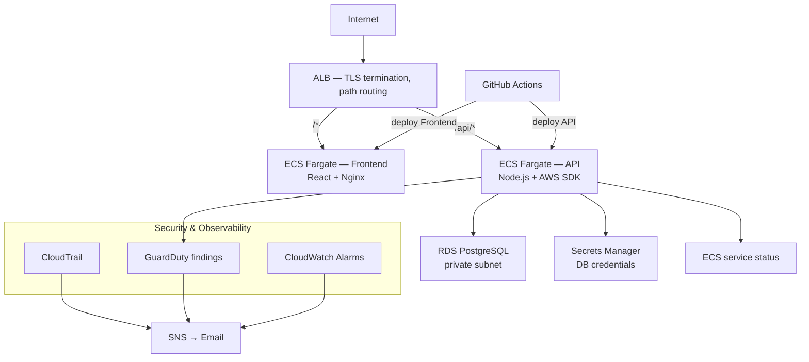

# Cloud Ops Platform

A production-inspired AWS infrastructure monitoring platform, built to demonstrate cloud infrastructure engineering practices: networking, security, observability, and operational excellence — not just resource provisioning.

## What this is

Most portfolio projects showcase an application. This one showcases the infrastructure *and* a tool that monitors that infrastructure — the platform you're looking at queries its own AWS environment in real time and reports on its health.

The homepage answers one question: **"Is my infrastructure healthy?"** — not "what resources do I have?"

## Architecture

**Networking**
- Multi-AZ VPC (2 AZs) with public and private subnets
- NAT Gateways per AZ for outbound-only internet access from private subnets
- Security groups chained least-privilege: ALB → ECS → RDS, no direct internet exposure beyond the ALB

**Compute**
- ECS Fargate — two independent services (API, frontend) behind one Application Load Balancer
- Path-based routing: `/api/*` → API service, everything else → frontend
- Zero-downtime rolling deployments (min 50% healthy during deploys)

**Data**
- RDS PostgreSQL, private subnet only, credentials in Secrets Manager (never in code or environment files)

**Security**
- CloudTrail — multi-region API call audit logging
- GuardDuty — automated threat detection
- IAM roles scoped per-service with least-privilege policies (API task role ≠ frontend task role)
- TLS termination at the ALB (HTTPS)

**Observability**
- CloudWatch Alarms on ECS CPU, task count, ALB 5xx errors, RDS CPU/connections
- SNS email alerting
- EventBridge routing GuardDuty findings to the same alert pipeline

**CI/CD**
- GitHub Actions — two independent pipelines (API, frontend), each triggered only by changes to its own path
- Automated build → ECR push → ECS rolling deployment

## Infrastructure as Code

All infrastructure is defined in Terraform with:
- Remote state (S3 backend + native S3 locking)
- Modular design — `vpc`, `security-groups`, `alb`, `ecs`, `ecs-cluster`, `rds`, `alerting`, `security`, `acm` as independent, reusable modules
- Environment separation (`staging`, with `prod` scaffolded for the same pattern)

## Why these decisions

| Decision | Reasoning |
|---|---|
| Two ECS services instead of one | Independent deploy cadence, independent scaling, mirrors real microservice separation |
| Chained security groups (not CIDR-based) | Each layer only accepts traffic from the layer directly above it — true least privilege |
| Secrets Manager over environment variables | Credentials never appear in Terraform state, task definitions, or logs in plaintext |
| Self-signed cert instead of a paid domain | This is a personal project without a registered domain; the TLS termination pattern is identical to a real ACM-validated cert — only the trust chain differs |
| EventBridge for GuardDuty, CloudWatch Alarms for metrics | Findings are discrete events, not numeric thresholds — the right tool for each signal type |

## Security Notes

This deployment uses a **self-signed TLS certificate** imported into ACM rather than a DNS-validated one, since the project has no registered domain. In production, this would be a standard ACM certificate validated via Route53 DNS — the Terraform pattern is otherwise identical (see `terraform/modules/acm`).

## Tech Stack

Terraform · AWS (VPC, ECS Fargate, RDS, ALB, IAM, Secrets Manager, CloudTrail, GuardDuty, CloudWatch, SNS, EventBridge, ACM, ECR) · Node.js · React (Vite) · Docker · GitHub Actions

## Running Locally

See [`docs/local-setup.md`](docs/local-setup.md) for frontend/API local development instructions.
